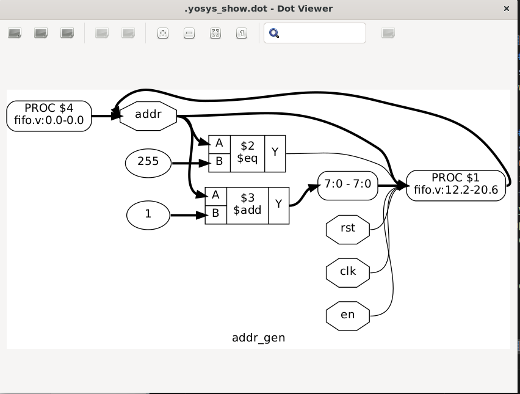
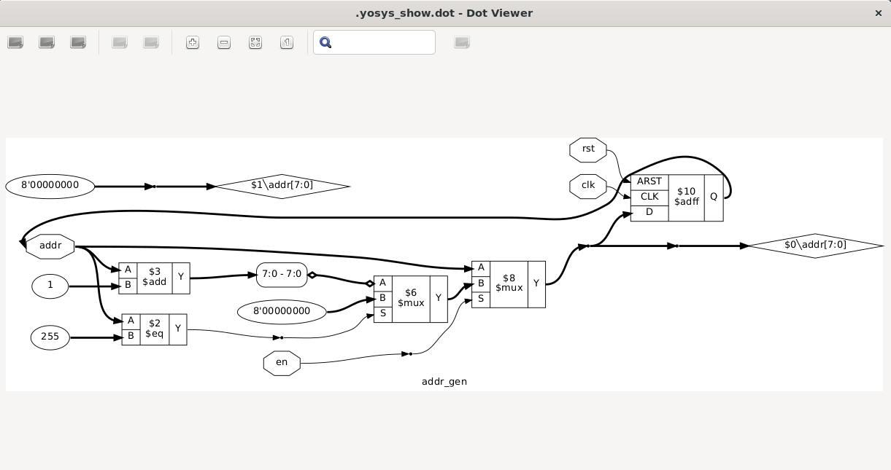
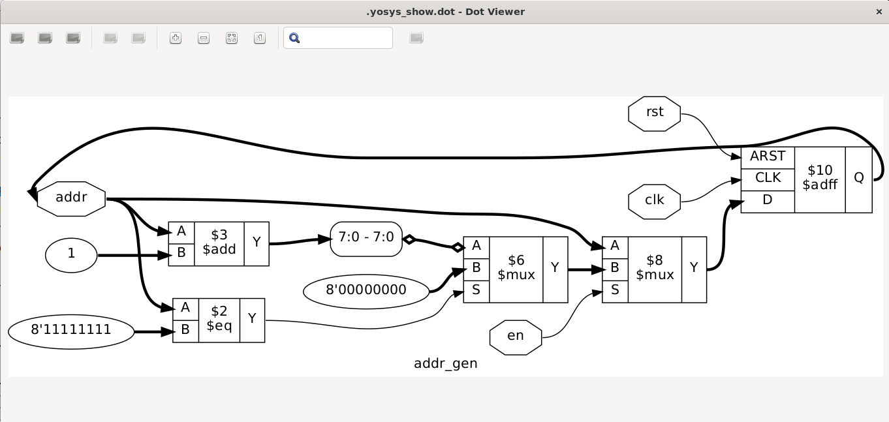

# Yosys 简单上手

开源综合工具

## 1.简单使用

[参考链接(yosys官方文档)](https://yosyshq.readthedocs.io/projects/yosys/en/latest/getting_started/example_synth.html#flattening)

安装好后输入yosys进入交互界面，对于命令，可以使用<kbd>Tab</kbd>键进行补全。

```bash
yosys> 
```
加载verilog文件
```bash
read_verilog <filename>
```

hierarchy命令，处理和层次结构相关的问题
如果使用了hierarchy命令制定了top，会自动发现找到使用的子模块，如果某个模块没有使用会自动删除，这时如果尝试使用read_verilog命令加载，但是重复加载了会报错退出。

给出检查层次结构和指定top的命令:
```bash
hierarchy -check -top <top>
```

可以使用show来查看节点图
例如:
```verilog
// demo1.v
module demo1(
    input a,
    input b,
    output c
);

wire med;
assign med = a ^ b ;
assign c = ~med;

endmodule
```
在终端中
```bash
yosys demo1.v
hierarchy -check -top demo1
show demo1
```
可以看到如下的网表图


进行优化
```bash
opt_clean
```
输出如下：
```bash
8. Executing OPT_CLEAN pass (remove unused cells and wires).
Finding unused cells or wires in module \demo1..
Removed 0 unused cells and 2 unused wires.
<suppressed ~1 debug messages>
```
可以看到消除了两条没用到的连线
网表图如下：


## 2.介绍官方Demo

文档链接见上参考链接。

这是一个在ice40 FPGA平台上创作的教程，但是指令和脚本很多都是通用的，因此无论是哪种架构，都可以学习调用的命令和他们所作的操作。

这里给出一个示例设计，用于接下来我们的操作

### 2.0 官方示例代码
```verilog
// 地址生成器/计数器
module addr_gen 
#(  parameter MAX_DATA=256,
	localparam AWIDTH = $clog2(MAX_DATA)
) ( input en, clk, rst,
	output reg [AWIDTH-1:0] addr
);
	initial addr <= 0;

	// 异步复位
	// 如果使能就增加地址
	always @(posedge clk or posedge rst)
		if (rst)
			addr <= 0;
		else if (en) begin
			if (addr == MAX_DATA-1)
				addr <= 0;
			else
				addr <= addr + 1;
		end
endmodule //addr_gen

// 定义了顶层的fifo实体
module fifo 
#(  parameter MAX_DATA=256,
	localparam AWIDTH = $clog2(MAX_DATA)
) ( input wen, ren, clk, rst,
	input [7:0] wdata,
	output reg [7:0] rdata,
	output reg [AWIDTH:0] count
);
	// fifo storage
	// sync read before write
	wire [AWIDTH-1:0] waddr, raddr;
	reg [7:0] data [MAX_DATA-1:0];
	always @(posedge clk) begin
		if (wen)
			data[waddr] <= wdata;
		rdata <= data[raddr];
	end // storage

	// addr_gen for both write and read addresses
	addr_gen #(.MAX_DATA(MAX_DATA))
	fifo_writer (
		.en     (wen),
		.clk    (clk),
		.rst    (rst),
		.addr   (waddr)
	);

	addr_gen #(.MAX_DATA(MAX_DATA))
	fifo_reader (
		.en     (ren),
		.clk    (clk),
		.rst    (rst),
		.addr   (raddr)
	);

	// status signals
	initial count <= 0;

	always @(posedge clk or posedge rst) begin
		if (rst)
			count <= 0;
		else if (wen && !ren)
			count <= count + 1;
		else if (ren && !wen)
			count <= count - 1;
	end

endmodule

```

### 2.1 加载设计
首先还是要先加载设计
```sh
yosys fifo.v
```
可以查看到结果为

```sh-output

 /----------------------------------------------------------------------------\
 |  yosys -- Yosys Open SYnthesis Suite                                       |
 |  Copyright (C) 2012 - 2024  Claire Xenia Wolf <claire@yosyshq.com>         |
 |  Distributed under an ISC-like license, type "license" to see terms        |
 \----------------------------------------------------------------------------/
 Yosys 0.40+50 (git sha1 0f9ee20ea, clang++ 17.0.6 -fPIC -Os)

-- Parsing `fifo.v' using frontend ` -vlog2k' --

1. Executing Verilog-2005 frontend: fifo.v
Parsing Verilog input from `fifo.v' to AST representation.
Storing AST representation for module `$abstract\addr_gen'.
Storing AST representation for module `$abstract\fifo'.
Successfully finished Verilog frontend.
```
已经将其转换为了AST树也就是抽象语法树


### 2.2 解析展开(Elaboration)

我们已经进入了交互式终端，可以直接调用Yosys的命令  
我们的目的是调用`synth_ice40 -top fifo`不过我们来单独调用各个命令来学习每个部分是如何进行整个工作流的  
我们将从简单的部分也就是`addr_gen`开始

使用`help synth_ice40`可以查看这条指令由许多指令组合而成  
我们先从标注为`begin`的段落开始

##### `begin`段落
```sh
read_verilog -D ICE40_HX -lib -specify +/ice40/cells_sim.v
hierarchy -check -top <top>
proc
```

第一句加载了ice40的单元模型，使我们能够导入平台特定的IP  
例如PLL，在我们使用的时候可能需要使用`SB_PLL40_CORE`而不是在综合映射阶段采才去使用。  
不过我们的设计也没有使用任何IP块，因此可以跳过这句指令。但是在后续的映射阶段仍然需要导入。

> 提示  
> +/是一个对Yosys的share目录的动态引用，一般是`/usr/local/share/yosys`

#### 2.2.1 addr_gen模块
我们先从`addr_gen`模块开始，从`hierarchy -top addr_gen`这条指令开始  

其中addr_gen的代码[见上](#20-官方示例代码)

> 提示
> `hierarchy`应该总是在加载完设计的第一条指令。通过指定顶层模块，`hierarchy`同时为他设定`(* top *)`这个参数。使得其他的指令能知道哪一个模块是top模块

##### 执行指令
```sh
hierarchy -top addr_gen
```
##### 指令执行结果
```sh
2. Executing HIERARCHY pass (managing design hierarchy).

3. Executing AST frontend in derive mode using pre-parsed AST for module `\addr_gen'.   
Generating RTLIL representation for module `\addr_gen'.

3.1. Analyzing design hierarchy..
Top module:  \addr_gen

3.2. Analyzing design hierarchy..
Top module:  \addr_gen
Removing unused module `$abstract\fifo'.
Removing unused module `$abstract\addr_gen'.
Removed 2 unused modules.
```

并且你可以用以下的指令查看网表图
##### 查看网表图
```sh
show addr_gen
```

##### 命令输出
```sh
4. Generating Graphviz representation of design.
Writing dot description to `/home/datou/.yosys_show.dot'.
Dumping module addr_gen to page 1.
Exec: { test -f '/home/datou/.yosys_show.dot.pid' && fuser -s '/home/datou/.yosys_show.dot.pid' 2> /dev/null; } || ( echo $$ >&3; exec xdot '/home/datou/.yosys_show.dot'; ) 3> '/home/datou/.yosys_show.dot.pid' &
```

并且有下面的窗口弹出


可以看到简单的操作例如`addr + 1`以及`addr == MAX_DATA-1`可以直接从我们的[源代码](#20-官方示例代码)的`always`块中被提取出来。其中有`$add`和`$eq`这些能够看到的元素。但是我们可以看到一些逻辑和内存元素不是很直观。这些部分被放到了`进程(processes)`中，例途中的符号`PROC`。注意的是其中的第二行指出了对应在`always`块中的开始和结束行数。对于`initial`块，我们可以看到`PROC`块的行数为0。

为了处理他们，要介绍下一个命令`proc`——将进程转换为网表。`proc`也是一个宏命令就像`synth_ice40`一样。不同于直接修改设计，我们将一个一个调用命令。对于`proc`命令，这些子命令将行为逻辑转换为多路复用器和寄存器。我们看看如果调用后会发生什么。不过现在，我们去调用`proc -noopt`来避免一些普遍的自动优化。

##### 将proc展开 并且不开启优化
```sh
proc -noopt
```

##### 指令执行结果 这里的序号可能与你的并不相同
```sh
14. Executing PROC pass (convert processes to netlists).

14.1. Executing PROC_CLEAN pass (remove empty switches from decision trees).
Cleaned up 0 empty switches.

14.2. Executing PROC_RMDEAD pass (remove dead branches from decision trees).
Marked 2 switch rules as full_case in process $proc$fifo.v:12$1 in module addr_gen.     
Removed a total of 0 dead cases.

14.3. Executing PROC_PRUNE pass (remove redundant assignments in processes).
Removed 0 redundant assignments.
Promoted 1 assignment to connection.

14.4. Executing PROC_INIT pass (extract init attributes).
Found init rule in `\addr_gen.$proc$fifo.v:0$4'.
  Set init value: \addr = 8'00000000

14.5. Executing PROC_ARST pass (detect async resets in processes).
Found async reset \rst in `\addr_gen.$proc$fifo.v:12$1'.

14.6. Executing PROC_ROM pass (convert switches to ROMs).
Converted 0 switches.
<suppressed ~2 debug messages>

14.7. Executing PROC_MUX pass (convert decision trees to multiplexers).
Creating decoders for process `\addr_gen.$proc$fifo.v:0$4'.
Creating decoders for process `\addr_gen.$proc$fifo.v:12$1'.
     1/1: $0\addr[7:0]

14.8. Executing PROC_DLATCH pass (convert process syncs to latches).

14.9. Executing PROC_DFF pass (convert process syncs to FFs).
Creating register for signal `\addr_gen.\addr' using process `\addr_gen.$proc$fifo.v:12$1'.
  created $adff cell `$procdff$10' with positive edge clock and positive level reset.   

14.10. Executing PROC_MEMWR pass (convert process memory writes to cells).

14.11. Executing PROC_CLEAN pass (remove empty switches from decision trees).
Removing empty process `addr_gen.$proc$fifo.v:0$4'.
Found and cleaned up 2 empty switches in `\addr_gen.$proc$fifo.v:12$1'.
Removing empty process `addr_gen.$proc$fifo.v:12$1'.
Cleaned up 2 empty switches.
```

可以看到，依次执行了多个不同的PASS来完成`proc`操作，结果图如下


可以看到由`always @`块出现了一些新的单元，同时寄存器使用了`$adff`块来实现。如果我们查看终端的输出可以看到不同的`proc_*`操作被调用，我们可以从[这里](https://yosyshq.readthedocs.io/projects/yosys/en/latest/using_yosys/synthesis/proc.html)查看更多信息。

可以注意到的是，在执行完`proc`指令之后出现了浮动的导线，是由`initial`语句向`addr`置零而来的。然而，`initial`语句是不可综合的，因此在生成物理硬件之前必须被清除。我们现在可以调用`clean`，同时也调用在执行`proc`之后都应该调用的`opt_expr`。我们可以使用在同一行使用分号隔开来同时执行。

##### 清理和优化表示
```sh
opt_expr; clean
```
结果如图所示


你可能注意到的是，`$eq`的输入从255转换为了二进制表示`8b11111111`，常量从被表示为了`<bid_width>'<bits>`这样的形式，转换为了二进制的bit量而不是使用十进制数字，同时也说明了从32bit的数转化为了8bit宽度的数字。这是一个由运行`opt_expr`带来的副作用。他带来了常量折叠和简单的表达式重写。对于更多的详细信息，可以参照[优化pass-官方](https://yosyshq.readthedocs.io/projects/yosys/en/latest/using_yosys/synthesis/opt.html)和[opt_expr的段](https://yosyshq.readthedocs.io/projects/yosys/en/latest/using_yosys/synthesis/opt.html#adv-opt-expr)

> 提示
> clean——清除没用过的单元和连线，可以在任何命令后通过两个分号调用，例如上面的`opt_expr; clean`可以简答的使用`opt_expr ;;`来进行调用。这能够帮你快速的去除不需要未连接的部分，这能帮下一步减少运算要求。
>
> #### 2.2.2 整个